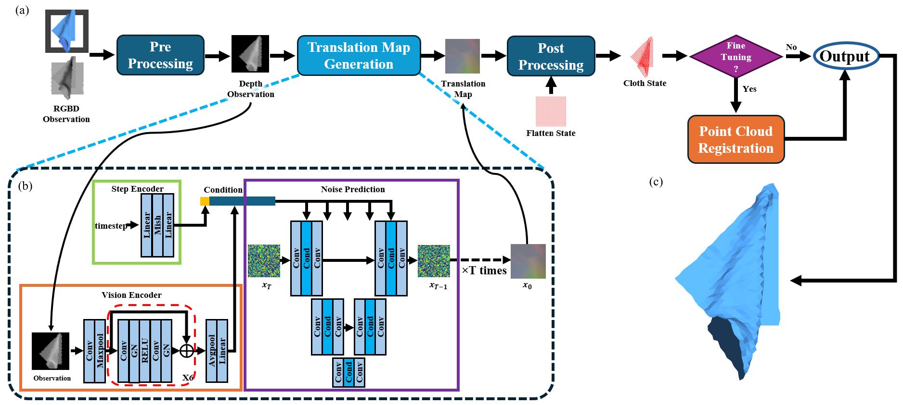

# RaggeDi: Diffusion-based State Estimation of Disordered Rags, Sheets, Towels and Blankets

## Author
Jikai Ye\*, Wanze Li\*, Shiraz Khan, Gregory S. Chirikjian

\* indicates equal contributions.

National University of Singapore

University of Delaware

## Abstract
Cloth state estimation is an important problem in robotics. It is essential for the robot to know the accurate state to manipulate cloth and execute tasks such as robotic dressing, stitching, and covering/uncovering human beings. However, estimating cloth state accurately remains challenging due to its high flexibility and self-occlusion. This paper proposes a diffusion model-based pipeline that formulates the cloth state estimation as an image generation problem by representing the cloth state as an RGB image that describes the point-wise translation (translation map) between a pre-defined flattened mesh and the deformed mesh in a canonical space. Then we train a conditional diffusion-based image generation model to predict the translation map based on an observation. Experiments are conducted in both simulation and the real world to validate the performance of our method. Results indicate that our method outperforms two recent methods in both accuracy and speed. 

## PipeLine

## Links
-  [Arxiv](https://arxiv.org/abs/2409.11831)
-  Code and data will be available soon
